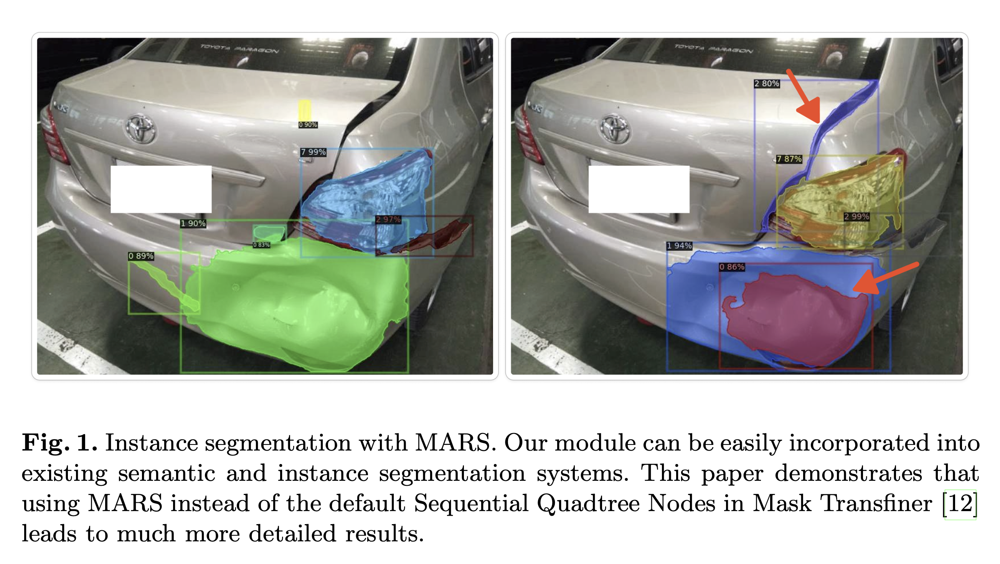
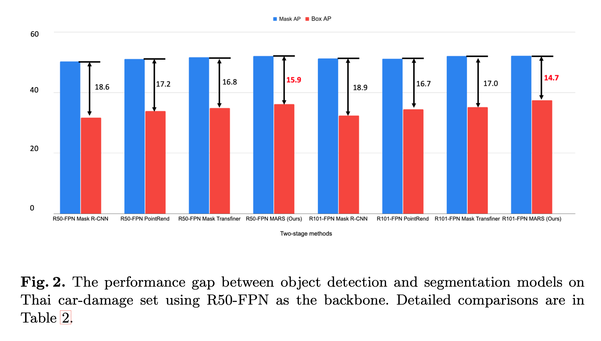
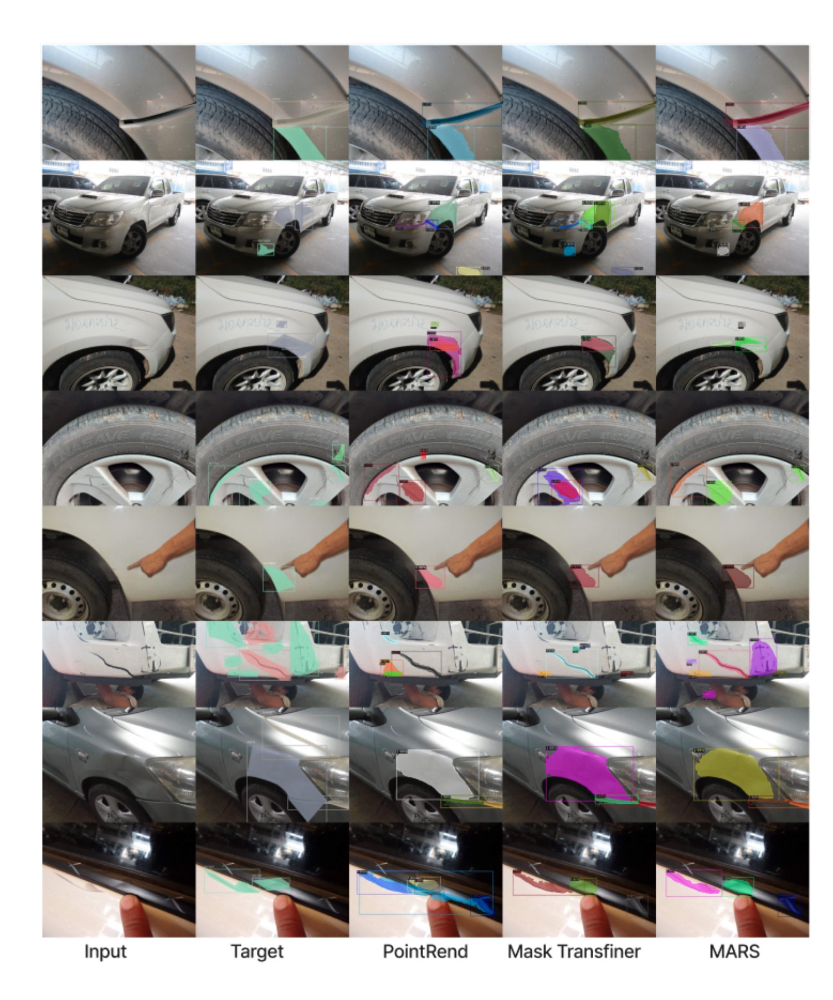

# 🚌 **MARS: Mask Attention Refinement with Sequential Quadtree Nodes for Car Damage Instance Segmentation**

[](LICENSE)

Welcome to the official repository for **MARS**—an innovative deep learning model tailored for precise car damage instance segmentation. Leveraging advanced self-attention mechanisms with sequential quadtree nodes, MARS delivers superior segmentation masks, surpassing state-of-the-art methods like Mask R-CNN, PointRend, and Mask Transfiner.


## 🛠️ **Project Overview**

In the realm of car insurance, accurately assessing vehicle damage is crucial. Traditional models often struggle with complex images and fine segmentation tasks. **MARS** (Mask Attention Refinement with Sequential Quadtree Nodes) addresses these challenges by recalibrating channel weights using a quadtree transformer, enhancing segmentation accuracy.

### **Key Achievements:**
- **+1.3 maskAP** improvement with the R50-FPN backbone.
- **+2.3 maskAP** improvement with the R101-FPN backbone on the Thai car-damage dataset.

**MARS** was showcased at the **International Conference on Image Analysis and Processing 2023 (ICIAP 2023)** in Udine, Italy.

## 👥 **Author**

- **Teerapong Panboonyuen (Kao Panboonyuen)**  

## 📄 **Publications**

If you're interested in exploring the academic work behind MARS, please check out the following publication:

- **MARS: Mask Attention Refinement with Sequential Quadtree Nodes for Car Damage Instance Segmentation**
  - **ACM:** [Link](https://dl.acm.org/doi/10.1007/978-3-031-51023-6_3)  
  - **ArXiv:** [Link](https://arxiv.org/pdf/2305.04743)  
  - **Springer (PDF):** [Link](https://link.springer.com/chapter/10.1007/978-3-031-51023-6_3)  
  - **Code:** [GitHub Repository](https://github.com/kaopanboonyuen/MARS)

## 🚀 **Quick Start**

### **Requirements**
- Python 3.8+
- PyTorch 1.8+
- CUDA 11.1+
- Other dependencies listed in `requirements.txt`

### **Installation**

1. **Clone the Repository:**
   ```bash
   git clone https://github.com/kaopanboonyuen/MARS.git
   cd MARS
   ```

2. **Set Up a Virtual Environment:**
   ```bash
   python3 -m venv mars-env
   source mars-env/bin/activate  # For Windows: `mars-env\Scripts\activate`
   ```

3. **Install Dependencies:**
   ```bash
   pip install -r requirements.txt
   ```

4. **Download Datasets:**
   - **Public Dataset:** [Download here](https://drive.google.com/file/d/1bbyqVCKZX5Ur5Zg-uKj0jD0maWAVeOLx/view) and place it in the `data/` directory.
   - **Private Dataset:** Access restricted due to licensing with **THAIVIVAT INSURANCE PCL.**

## 🎯 **How to Use**

1. **Train the Model:**
   ```bash
   python train.py --config configs/mars_config.yaml
   ```

2. **Evaluate the Model:**
   ```bash
   python evaluate.py --checkpoint checkpoints/mars_best_model.pth --data data/test/
   ```

3. **Run Inference:**
   ```bash
   python inference.py --image_path images/sample.jpg --output_dir results/
   ```

## 🌐 **Live Demos**

Experience MARS in action: [Visit GitHub Pages](https://kaopanboonyuen.github.io/MARS)

## 📂 **Datasets**

Our models were trained on both public and private datasets:

- **Public Dataset:** [Download here](https://drive.google.com/file/d/1bbyqVCKZX5Ur5Zg-uKj0jD0maWAVeOLx/view)
- **Private Dataset:** Access restricted due to licensing agreements with our partner **THAIVIVAT INSURANCE PCL.**

## 🔍 **Citation**

If you find our work helpful, please consider citing it:

```bibtex
@inproceedings{panboonyuen2023mars,
  title={MARS: Mask Attention Refinement with Sequential Quadtree Nodes for Car Damage Instance Segmentation},
  author={Panboonyuen, Teerapong and others},
  booktitle={International Conference on Image Analysis and Processing},
  pages={28--38},
  year={2023},
  organization={Springer}
}
```

## 📜 **License**

This project is licensed under the MIT License. For more details, see the [LICENSE](LICENSE) file.

## 📧 **Contact**

For inquiries or collaborations, feel free to reach out:

- **Author:** [Teerapong Panboonyuen (Kao Panboonyuen)](https://kaopanboonyuen.github.io)
- **Email:** [panboonyuen.kao@gmail.com](mailto:panboonyuen.kao@gmail.com)
- **MARS (Motor AI Recognition Solution):** [https://www.marssolution.io](https://www.marssolution.io)





